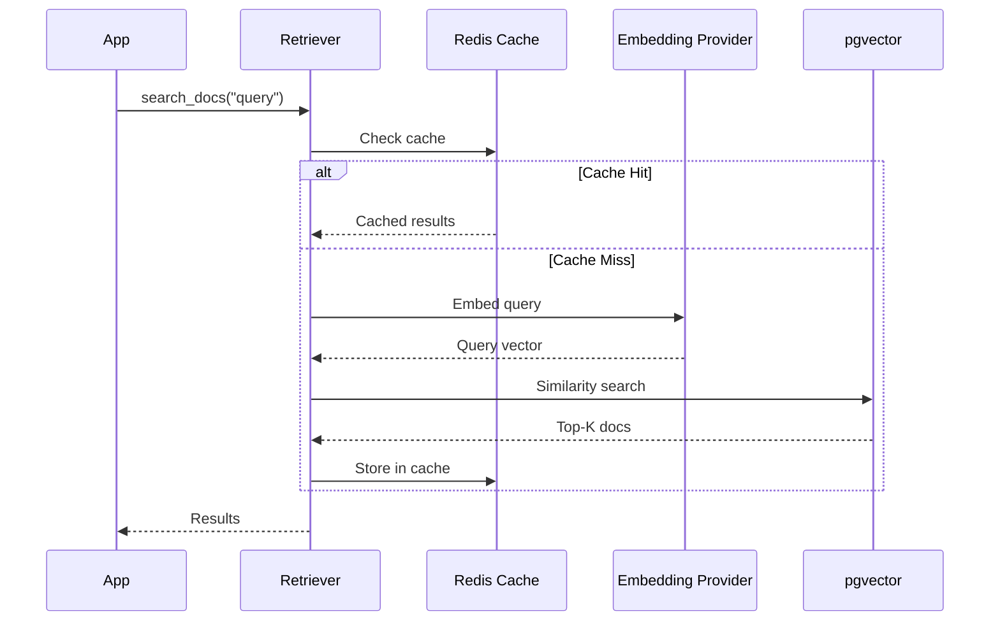

# Retrievers

> **TL;DR:** Use `@retriever` to define semantic search functions. Meridian handles embedding, vector search, and caching automatically.

## What is a Retriever?

A **Retriever** is a function that searches an index and returns relevant documents. The `@retriever` decorator transforms a simple function into a full vector search pipeline.

```python
from meridian.retrieval import retriever

@retriever(index="knowledge_base", top_k=5)
async def search_docs(query: str):
    # Magic Wiring: Automatically searches `knowledge_base` index.
    pass
```

## Basic Usage

### Define a Retriever

```python
from meridian.core import FeatureStore
from meridian.retrieval import retriever

store = FeatureStore()

@retriever(index="knowledge_base", top_k=5)
async def search_knowledge(query: str):
    # Pass 'query' argument automatically to vector search
    pass
```

### Call the Retriever

```python
# In async context
results = await search_knowledge("How do I configure Redis?")
# Returns: ["Redis is configured via MERIDIAN_REDIS_URL...", ...]
```

## Parameters

| Parameter | Type | Description | Default |
| :--- | :--- | :--- | :--- |
| `name` | `str` | Name of the retriever (defaults to function name) | Optional |
| `index` | `str` | Name of vector index to search (activates Magic Wiring) | Optional |
| `top_k` | `int` | Number of results to return (used with `index`) | `5` |
| `backend` | `str` | Backend type ("custom" or "postgres") | "custom" |
| `cache_ttl` | `int` | Seconds to cache results in Redis | `0` (no cache) |

## Caching

Enable caching to reduce vector search latency for repeated queries:

```python
@retriever(index="docs", top_k=5, cache_ttl=timedelta(seconds=300))
async def cached_search(query: str) -> list[str]:
    pass
```

**How it works:**
1. Query is hashed to create cache key.
2. If cached, return immediately from Redis.
3. If not cached, perform vector search and cache results.

**Cache key format:** `retriever:{index}:{query_hash}`

## Similarity Threshold

Filter out low-relevance results:

```python
@retriever(index="docs", top_k=10)
async def high_quality_search(query: str) -> list[str]:
    # Returns top 10 most relevant documents
    pass
```

## DAG Wiring

Retrievers can be wired into feature DAGs using template syntax:

```python
@feature(entity=User)
def user_context(user_id: str) -> str:
    return "Query: {search_docs}"  # Will call search_docs retriever
```

The `DependencyResolver` automatically:
1. Parses `{retriever_name}` templates.
2. Resolves retriever dependencies.
3. Injects results into the feature computation.

## Custom Embedding

Override the default embedding provider:

```python
@retriever(index="docs", top_k=5)
async def cohere_search(query: str) -> list[str]:
    # Embedding provider is configured globally via MERIDIAN_EMBEDDING_PROVIDER
    # or COHERE_API_KEY environment variable
    pass
```

## Multiple Indexes

Search across different document collections:

```python
@retriever(index="product_docs", top_k=3)
async def search_products(query: str) -> list[str]:
    pass

@retriever(index="support_tickets", top_k=3)
async def search_tickets(query: str) -> list[str]:
    pass

# Combine in context assembly
@context(store, max_tokens=4000)
async def support_context(query: str) -> list[ContextItem]:
    products = await search_products(query)
    tickets = await search_tickets(query)
    return [
        ContextItem(content=str(products), priority=1),
        ContextItem(content=str(tickets), priority=2),
    ]
```

## Metadata Filtering

Filter results by document metadata:

```python
@retriever(index="docs", top_k=5)
async def search_docs(query: str, version: str = None) -> list[str]:
    # Metadata filter applied automatically if version provided
    pass

# Usage
results = await search_docs("How to configure?", version="1.2.0")
```

## Error Handling

Retrievers handle errors gracefully:

```python
@retriever(index="docs", top_k=5)
async def safe_search(query: str) -> list[str]:
    pass

# If index doesn't exist or search fails:
# - Returns empty list []
# - Logs warning with details
# - Does not raise exception
```

## Performance Tips

1. **Use caching** for repeated queries: `cache_ttl=300`
2. **Set threshold** to filter low-quality results: `threshold=0.7`
3. **Limit top_k** to what you need: smaller is faster
4. **Pre-warm cache** for common queries at startup

## Under the Hood

When you call a retriever:



## Next Steps

- [Context Assembly](context-assembly.md): Combine retrievers with token budgets
- [Event-Driven Features](event-driven-features.md): Update retrievers on events
- [Context Store Overview](context-store.md): Full context infrastructure

<script type="application/ld+json">
{
  "@context": "https://schema.org",
  "@type": "TechArticle",
  "headline": "Retrievers: Semantic Search with @retriever",
  "description": "Define semantic search functions with Meridian's @retriever decorator. Automatic embedding, pgvector search, result caching, and DAG wiring.",
  "author": {"@type": "Organization", "name": "Meridian Team"},
  "keywords": "retriever, semantic search, vector search, pgvector, rag",
  "articleSection": "Documentation"
}
</script>
