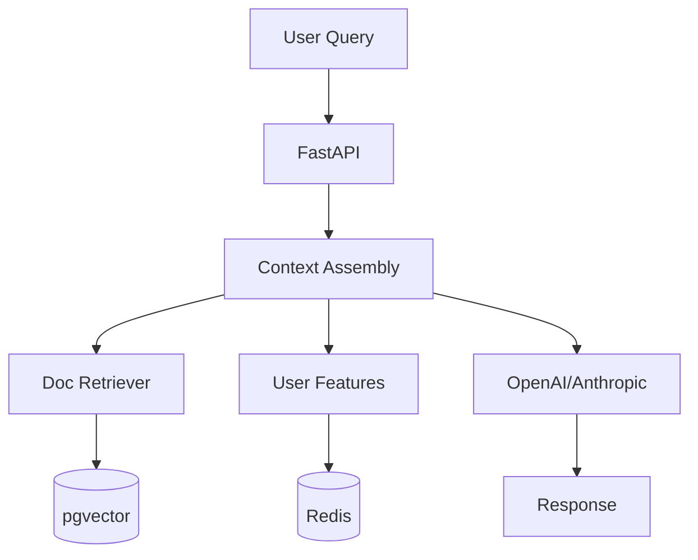

# Use Case: Production RAG Chatbot

> **TL;DR:** Build a production-ready RAG chatbot that combines document retrieval with user personalization—all in ~100 lines of Python.

## The Goal

Build a customer support chatbot that:
1. **Searches knowledge base** for relevant docs
2. **Personalizes responses** based on user tier and history
3. **Updates in real-time** when docs change
4. **Stays within token limits** for cost control

## Architecture Overview



## Step 1: Define Entities and Features

```python
# chatbot.py
from meridian.core import FeatureStore, entity, feature
from datetime import timedelta

store = FeatureStore()

@entity(store)
class User:
    user_id: str

@entity(store)
class Document:
    doc_id: str

# User features for personalization
@feature(entity=User, materialize=True, refresh=timedelta(hours=1))
async def user_tier(user_id: str) -> str:
    # From your database
    return await db.get_user_tier(user_id)

@feature(entity=User, materialize=True)
async def support_history(user_id: str) -> list[str]:
    # Last 5 support tickets
    return await db.get_recent_tickets(user_id, limit=5)

@feature(entity=User, trigger="message_sent")
async def message_count(user_id: str, event) -> int:
    current = await store.get_feature("message_count", user_id) or 0
    return current + 1
```

## Step 2: Index Your Knowledge Base

```python
# index_docs.py
import asyncio
from chatbot import store

async def index_knowledge_base():
    docs = [
        {"id": "doc_1", "text": "To reset your password, go to Settings > Security...", "category": "account"},
        {"id": "doc_2", "text": "Billing is processed on the 1st of each month...", "category": "billing"},
        {"id": "doc_3", "text": "Premium users get priority support and...", "category": "plans"},
    ]

    for doc in docs:
        await store.index(
            index_name="knowledge_base",
            entity_id=doc["id"],
            text=doc["text"],
            metadata={"category": doc["category"]}
        )

    print(f"Indexed {len(docs)} documents")

asyncio.run(index_knowledge_base())
```

## Step 3: Define Retrievers

```python
# chatbot.py (continued)
from meridian.retrieval import retriever

@retriever(store, index="knowledge_base", top_k=3, cache_ttl=300)
async def search_docs(query: str) -> list[str]:
    # Automatic vector search via pgvector
    pass

@retriever(store, index="knowledge_base", top_k=1)
async def search_billing_docs(query: str) -> list[str]:
    # Filtered to billing category (via metadata)
    pass
```

## Step 4: Assemble Context

```python
# chatbot.py (continued)
from meridian.context import context, Context, ContextItem

SYSTEM_PROMPT = """You are a helpful customer support agent for Acme Corp.
Be concise, friendly, and helpful. If you don't know something, say so."""

@context(store, max_tokens=4000)
async def chat_context(user_id: str, query: str) -> Context:
    # Fetch all components
    docs = await search_docs(query)
    tier = await store.get_feature("user_tier", user_id)
    history = await store.get_feature("support_history", user_id)

    # Build context with priorities
    items = [
        ContextItem(SYSTEM_PROMPT, priority=0, required=True),
        ContextItem(
            f"User tier: {tier}. Adjust tone accordingly.",
            priority=1,
            required=True
        ),
        ContextItem(
            "Relevant documentation:\n" + "\n---\n".join(docs),
            priority=2,
            required=True
        ),
    ]

    # Add history for premium users (truncated first if over budget)
    if tier == "premium" and history:
        items.append(ContextItem(
            f"Previous tickets:\n" + "\n".join(history),
            priority=3  # Lowest priority, truncated first
        ))

    return Context(items=items)
```

## Step 5: Create the API

```python
# chatbot.py (continued)
from fastapi import FastAPI, HTTPException
from pydantic import BaseModel
import openai

app = FastAPI()

class ChatRequest(BaseModel):
    user_id: str
    message: str

class ChatResponse(BaseModel):
    response: str
    context_tokens: int

@app.post("/chat", response_model=ChatResponse)
async def chat(request: ChatRequest):
    # Get assembled context
    ctx = await chat_context(request.user_id, request.message)

    # Call LLM
    response = await openai.ChatCompletion.acreate(
        model="gpt-4",
        messages=[
            {"role": "system", "content": ctx.to_string()},
            {"role": "user", "content": request.message}
        ]
    )

    return ChatResponse(
        response=response.choices[0].message.content,
        context_tokens=ctx.total_tokens
    )
```

## Step 6: Real-Time Doc Updates

Keep context fresh when documents change:

```python
# chatbot.py (continued)
from meridian.events import AxiomEvent

@feature(entity=Document, trigger="doc_updated")
async def doc_content(doc_id: str, event: AxiomEvent) -> str:
    content = event.payload["content"]

    # Re-index in vector store
    await store.index(
        index_name="knowledge_base",
        entity_id=doc_id,
        text=content,
        metadata=event.payload.get("metadata", {})
    )

    return content
```

Publish updates from your CMS:

```python
# cms_webhook.py
from meridian.bus import RedisEventBus
from meridian.events import AxiomEvent

bus = RedisEventBus()

async def on_doc_save(doc_id: str, content: str, metadata: dict):
    await bus.publish(AxiomEvent(
        event_type="doc_updated",
        entity_id=doc_id,
        payload={"content": content, "metadata": metadata}
    ))
```

## Step 7: Run It

```bash
# Terminal 1: Start server
meridian serve chatbot.py

# Terminal 2: Start worker (for event processing)
meridian worker chatbot.py

# Terminal 3: Test it
curl -X POST http://localhost:8000/chat \
  -H "Content-Type: application/json" \
  -d '{"user_id": "user_123", "message": "How do I reset my password?"}'
```

## Production Considerations

### Token Budget by Tier

```python
@context(store, max_tokens=4000)
async def chat_context(user_id: str, query: str) -> Context:
    tier = await store.get_feature("user_tier", user_id)

    # Premium gets more context
    budget = 8000 if tier == "premium" else 4000
    top_k = 5 if tier == "premium" else 3

    docs = await search_docs(query)  # Uses top_k from retriever

    return Context(
        items=[...],
        max_tokens=budget
    )
```

### Rate Limiting

```python
@app.post("/chat")
async def chat(request: ChatRequest):
    count = await store.get_feature("message_count", request.user_id) or 0
    tier = await store.get_feature("user_tier", request.user_id)

    limit = 100 if tier == "premium" else 20
    if count >= limit:
        raise HTTPException(429, "Rate limit exceeded")

    # Continue with chat...
```

### Observability

```python
# Debug context assembly
@app.get("/debug/context/{user_id}")
async def debug_context(user_id: str, query: str):
    trace = await store.explain_context("chat_context", user_id=user_id, query=query)
    return trace
```

## Full Code

See the complete example at: `examples/rag_chatbot.py`

## Metrics

With this setup, you get:

| Metric | Value |
| :--- | :--- |
| Context assembly latency | ~50ms |
| Vector search latency | ~20ms (cached: ~2ms) |
| Feature retrieval | ~5ms (Redis) |
| Total overhead | ~75ms |

## Next Steps

- [Context Store Overview](../context-store.md): Deep dive into RAG infrastructure
- [Retrievers](../retrievers.md): Advanced search patterns
- [Event-Driven Features](../event-driven-features.md): Real-time updates
- [Architecture](../architecture.md): System design

<script type="application/ld+json">
{
  "@context": "https://schema.org",
  "@type": "HowTo",
  "name": "Build a Production RAG Chatbot with Meridian",
  "description": "Step-by-step guide to building a production RAG chatbot with vector search, context assembly, and real-time updates.",
  "totalTime": "PT30M",
  "tool": [{"@type": "HowToTool", "name": "Meridian OSS"}, {"@type": "HowToTool", "name": "OpenAI API"}],
  "step": [
    {"@type": "HowToStep", "name": "Define entities and features", "text": "Create User and Document entities with personalization features."},
    {"@type": "HowToStep", "name": "Index knowledge base", "text": "Use store.index() to add documents with embeddings."},
    {"@type": "HowToStep", "name": "Define retrievers", "text": "Create @retriever functions for semantic search."},
    {"@type": "HowToStep", "name": "Assemble context", "text": "Use @context to combine docs, features with token budgets."},
    {"@type": "HowToStep", "name": "Create API", "text": "Build FastAPI endpoint that calls LLM with context."},
    {"@type": "HowToStep", "name": "Enable real-time updates", "text": "Use event triggers to re-index when docs change."}
  ]
}
</script>
